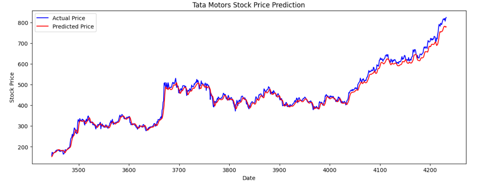
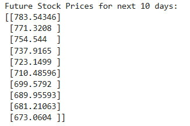

# Stock Price Prediction Using LSTM

## Overview

This project predicts Tata Motors stock prices using Long Short-Term Memory (LSTM) neural networks. Historical stock data is analyzed to learn market trends and forecast future prices.

## Technologies Used

- Python
- Pandas
- NumPy
- TensorFlow
- Keras
- Matplotlib
- Scikit-Learn

## Features

- Historical stock data analysis
- Data preprocessing and normalization
- LSTM model training
- Actual vs Predicted stock price comparison
- Future stock price forecasting
- Model evaluation using MSE and RMSE

## Results

### Actual vs Predicted Stock Prices

### Future Stock Price Prediction

## Dataset

Tata Motors historical stock data (2006–2024)

## Author

Jaina Shajil
